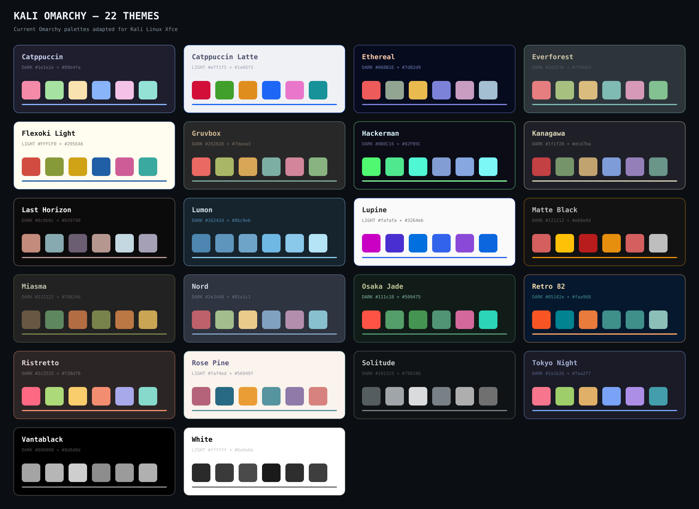

# Kali Omarchy 2.0.1

[](https://github.com/Ankit-ku-panda/Kali-Omarchy-Xfce/releases)
[](https://github.com/Ankit-ku-panda/Kali-Omarchy-Xfce/actions/workflows/test.yml)
[](LICENSE)

An Omarchy-style command center and complete 22-theme layer for **Kali Linux
Xfce**. It keeps Kali and Xfce in place while adapting the current Omarchy theme,
menu, hotkey, terminal, editor, wallpaper, capture, reminder, and toggle ideas.

This is not the Omarchy operating system and does not install Hyprland.



## What is included

- All 22 current Omarchy color palettes, including five light themes
- Two original 1920×1080 SVG wallpapers per theme
- Live GTK 3/4, Xfce panel, Rofi, QTerminal, and Xfce Terminal styling
- Generated palettes for btop, Neovim/Vim, tmux, VS Code/VSCodium, Kitty,
  Foot, Alacritty, and Ghostty
- A unified `Super+Space` Rofi menu
- Omarchy-like Xfce hotkeys, workspaces, notices, reminders, toggles,
  screenshots, OCR, QR recognition, and screen-recorder handoff
- Theme-aware Bash and Zsh prompts plus useful shell helpers
- A restore point created before the first desktop change
- Safe color-only installation of compatible remote themes

See [the analysis and coverage matrix](docs/OMARCHY-ANALYSIS.md) for every theme,
manual-area mapping, and the intentional Xfce boundaries.

## Install

Open a terminal as your **normal Kali desktop user**. If the prompt says
`root@kali`, type `exit` first.

```bash
unzip Kali-Omarchy-Theme.zip
cd Kali-Omarchy-Theme
chmod +x install.sh
./install.sh
```

The installer uses `sudo` only for available APT packages. After installation,
close and reopen the terminal. Log out and in once if Xfce does not refresh.

Installer options:

```bash
./install.sh --minimal      # core theme, font, shell, and launcher packages
./install.sh --no-packages  # use only software already installed
./install.sh --no-apply     # install files without changing the desktop
./install.sh --help
```

## Start here

```bash
kali-omarchy menu          # unified menu
kali-omarchy theme         # choose one of 22 themes
kali-omarchy background    # choose the active theme's wallpaper
kali-omarchy hotkeys       # complete keyboard guide
kali-omarchy doctor        # show missing optional tools
kali-omarchy restore       # return to pre-theme settings
```

Press `Super+Space` for the main menu, `Super+Alt+Space` for applications,
`Super+Ctrl+Shift+Space` for themes, and `Super+K` for the hotkey guide.
The full CLI is in [docs/COMMANDS.md](docs/COMMANDS.md).

## Themes

Dark: Catppuccin, Ethereal, Everforest, Gruvbox, Hackerman, Kanagawa,
Last Horizon, Lumon, Matte Black, Miasma, Nord, Osaka Jade, Retro 82,
Ristretto, Solitude, Tokyo Night, and Vantablack.

Light: Catppuccin Latte, Flexoki Light, Lupine, Rose Pine, and White.

Tokyo Night is the default. Change it at any time:

```bash
kali-omarchy theme set osaka-jade
kali-omarchy theme next
```

## Restore and safety

The first `apply` records relevant files and Xfce values beneath
`~/.local/state/kali-omarchy/backups/`. Repeated theme changes keep that original
restore point. `kali-omarchy restore` puts those settings back.

The project does not replace Kali, edit boot configuration, repartition disks,
change encryption, install Hyprland, remove Kali tools, or alter firewall policy.
APT packages remain after uninstall because other programs may use them.

## Compatibility

- Designed for current Kali Linux with Xfce
- QTerminal and Xfce Terminal are configured automatically
- GTK, terminal, shell, editor, and TUI integrations still work when Xfce is not active
- Desktop/hotkey changes require a graphical Xfce session
- Not intended for CLI-only WSL, NetHunter CLI, or recovery environments

## Troubleshooting

```bash
kali-omarchy doctor
kali-omarchy apply
```

If APT reports that a package has no installation candidate, download the
latest package again and rerun the installer. Version 2.0.1 checks the actual
APT candidate and skips obsolete package names automatically.

If `kali-omarchy` is not found immediately after installation, open a new
terminal or run `~/.local/bin/kali-omarchy status`. Restore from a terminal
inside Xfce, not from SSH or a text-only TTY.

## Credits and license

Inspired by [Omarchy](https://github.com/basecamp/omarchy). Palette provenance is
documented in [THIRD_PARTY_NOTICES.md](THIRD_PARTY_NOTICES.md). All wallpapers and
Kali/Xfce integration code in this package are original. MIT licensed; see
[LICENSE](LICENSE).

Created and maintained by [Ankit Kumar Panda](https://github.com/Ankit-ku-panda).
See [CONTRIBUTING.md](CONTRIBUTING.md) before submitting changes and
[SECURITY.md](SECURITY.md) for private vulnerability reporting.
